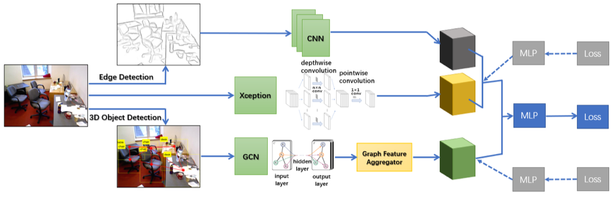

## COOL: Contour and Object-Oriented Learning for Indoor Cleanliness Classification

## Abstract
<span style="font-size: 1.5em;">The evaluation of indoor cleanliness is a meaningful task for vision-based household service systems. However, the perception of cleanliness is determined by diverse visual features and multiple criteria, which is subjective to the observer. We find the existing dataset and method fail to truthfully capture the concept of cleanliness because the feature used is not representative to human subjective judgement. Therefore, we create a dataset for indoor cleanliness classification from a group of annotators based on SUN-RGBD, a richly annotated scene understanding benchmark. Based on such analysis, we propose Contour and Object-oriented Learning (COOL) model that integrates pretrained convolutional feature, low-level contour feature, and object arrangement in order to truthfully model the notion of cleanliness. Our design choices are justified in ablation studies, and our model outperforms the previous method in our dataset for cleanliness classification.</span>

<center></center> 

## Authors 
<table style="width:100% bgcolor:#FFFFFF" align="center">
  <tr align="center">
    <th>Sucheng Qian</th>
    <th>Zhaoyu Li</th>
    <th>Weibang Jiang</th>
  </tr>
</table>

## Demo 
<span style="font-size: 1.5em;"> An introduction video to this project can be downloaded here [link](https://jbox.sjtu.edu.cn/link/view/2f2f1e8ea0f1464fb45b3fe71db68441).</span>

## Code 
### Prerequisites
- Linux / macOS
- NVIDIA GPU with CUDA CuDNN
- Python 3

### Getting Started
- Clone this repo
```bash
git clone https://github.com/OolongQian/Cleanliness-Classification
cd Cleanliness-Classification
```
- Data preparation (Please wait for Google Drive to complete uploading)
- Model training with testing
```bash
python3 train_cool.py
```
- Run baseline
```bash
python3 train_visual.py
```

### Citation
    @article{Qian2019COOL
        author = {Sucheng, Qian and Zhaoyu, Li and Weibang, Jiang",
        title = {Contour and Object-Oriented Learning for Indoor Cleanliness Classification},
        year = {2019},
        howpublished={\url{https://github.com/OolongQian/Cleanliess-Classification}}
    }

### Acknowledgements 
- The images and object-centric annotations of this dataset are created out of SUNRGBD. 
- The image contours are processed using Holistically-Nested Edge Detection [1], implemented in PyTorch by [2]. 


## references
```
[1]  @inproceedings{Xie_ICCV_2015,
         author = {Saining Xie and Zhuowen Tu},
         title = {Holistically-Nested Edge Detection},
         booktitle = {IEEE International Conference on Computer Vision},
         year = {2015}
     }
```

```
[2]  @misc{pytorch-hed,
         author = {Simon Niklaus},
         title = {A Reimplementation of {HED} Using {PyTorch}},
         year = {2018},
         howpublished = {\url{https://github.com/sniklaus/pytorch-hed}}
    }
```
